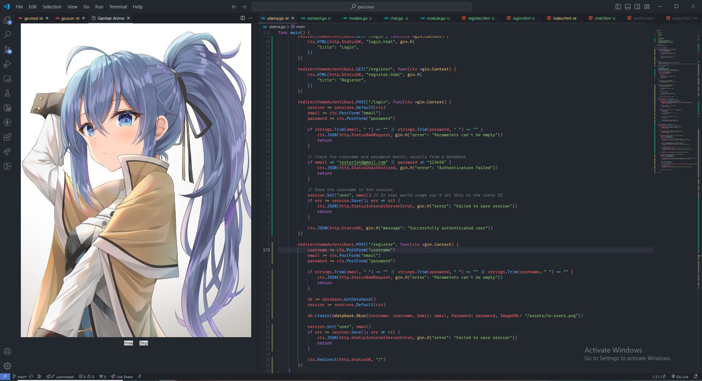

# gambarAnime README

Coding while looking at an anime picture.

How to use: Press CTRL + SHIFT + P and type "Gambar Anime"

https://marketplace.visualstudio.com/items?itemName=rafiathallah3.gambarAnime